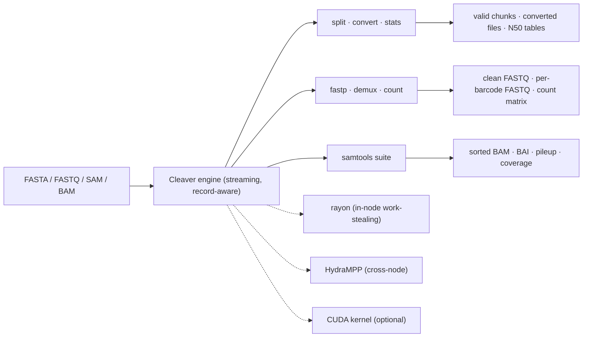
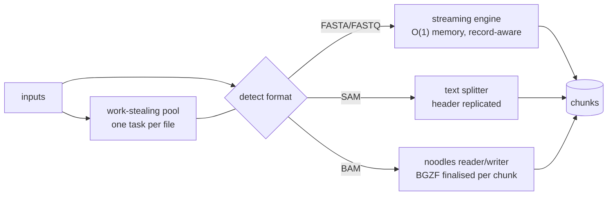

# ✂️ Cleaver

### *Record-aware splitting, conversion, QC, counting and alignment utilities — at streaming speed, in pure Rust.*

<div align="center">


### 🧬 Never Cuts a Record • ⚡ Constant Memory • 🔬 Byte-Identical to samtools/fastp/featureCounts • 🚀 Laptop to Cluster

</div>

---

# 🔬 What is Cleaver?

**Cleaver** is a high-performance bioinformatics toolkit written in **Rust** that
handles the everyday sequence and alignment formats:

* 🧬 FASTA (and every variant: `.fa .fna .ffn .faa .frn .mpfa .fas`)
* 🧪 FASTQ (plain or gzipped)
* 📄 SAM
* 🗜️ BAM (BGZF)

It **splits files into chunks without ever cutting a record in half**, converts
between formats, computes assembly statistics, preprocesses reads, demultiplexes
barcodes, counts reads per feature, and ships a **samtools-compatible** utility
suite — then fans the work across cores or a whole cluster.

Everything is **100% Rust**. `fastp`, the VERSE/featureCounts counting modes, the
`barbell` demultiplexer, and the `samtools` utilities are native
re-implementations, **not shell-outs**, so the whole toolkit builds from `cargo`
with no C/C++ or Python dependencies.

---

# ✨ Features

<table>
<tr>
<td width="50%">

## 🧬 Sequence & Alignment Core

* Record-aware splitting (FASTA/FASTQ/SAM/BAM)
* Constant-memory streaming
* SAM ↔ BAM conversion
* FASTQ → FASTA
* Mapped / unmapped partitioning
* Transparent `.gz` input and output
* Auto format detection (extension + content sniff)
* Every chunk is an independently valid file

</td>
<td width="50%">

## 🔧 Re-implemented Workhorses

* **fastp** — adapter/quality/polyX trim, filtering, PE overlap correction, JSON report
* **featureCounts / htseq / VERSE** — reads per feature, multi-feature hierarchical assignment
* **barbell** — ONT barcode demux, fit-aligned at both ends
* **samtools** — `view` `sort` `index` `fastq` `fasta` `flagstat` `idxstats` `merge` `faidx` `depth` `mpileup` `coverage`
* Genome/assembly stats — N50 / L50 / N90, GC%, lengths
* Exact `-f` / `-F` flag semantics

</td>
</tr>
</table>

---

# ⚡ Why Cleaver?

| Feature | Cleaver |
| --- | --- |
| 🧬 Never splits a record in half | ✅ |
| 🌊 Constant-memory streaming | ✅ |
| 🦀 Pure Rust — no C/C++/Python deps | ✅ |
| 🔬 Byte-identical to samtools / fastp / featureCounts | ✅ |
| 🚫 `#![forbid(unsafe_code)]` on the engine | ✅ |
| ⚙️ Multi-threaded, work-stealing (rayon) | ✅ |
| 🌍 Cross-node scaling (HydraMPP) | ✅ |
| 🖥️ Optional CUDA base-composition kernel | ✅ |
| 🩺 Built-in end-to-end self-test (`doctor`) | ✅ |
| 📚 Usable as a CLI **and** a library crate | ✅ |

---

# 🧬 Formats

| Family | Extensions | Split unit | Engine |
|---|---|---|---|
| FASTA | `.fasta .fa .fna .ffn .faa .frn .mpfa .fas` | size (`--chunk-size`) | streaming, byte-level |
| FASTQ | `.fastq .fq` | size (`--chunk-size`, 4-line aware) | streaming, byte-level |
| SAM | `.sam` | records (`--records`) | text, header replicated |
| BAM | `.bam` | records (`--records`) | `noodles` (BGZF) |

`.gz` inputs are decompressed transparently. Format is auto-detected from the
extension, falling back to a content sniff. Chunks keep the input's extension
(`genome.fna` → `genome.00000.fna`); SAM/BAM chunks are written as `.sam`/`.bam`.

---

# 🧱 Architecture



---

# 🦀 Tech Stack

| Component | Technology |
| --- | --- |
| Core engine | Rust (`#![forbid(unsafe_code)]`) |
| SAM/BAM/BGZF/BAI I/O | [`noodles`](https://github.com/zaeleus/noodles) |
| In-node parallelism | [`rayon`](https://github.com/rayon-rs/rayon) |
| Cross-node parallelism | [`hydra-mpp`](https://crates.io/crates/hydra-mpp) |
| gzip | [`flate2`](https://github.com/rust-lang/flate2-rs) (pure-Rust backend) |
| CLI | [`clap`](https://github.com/clap-rs/clap) |
| Error handling | [`anyhow`](https://github.com/dtolnay/anyhow) |
| Job serialization | [`serde`](https://serde.rs) |
| GPU (optional) | [`cudarc`](https://github.com/coreylowman/cudarc) |
| Assembly metrics (optional) | [`rustyomestats`](https://crates.io/crates/rustyomestats) |

---

# 🚀 Installation

## 1️⃣ Install Rust

```bash
curl --proto '=https' --tlsv1.2 -sSf https://sh.rustup.rs | sh
rustup default stable
```

Cleaver needs **rustc 1.75+**. No `rustup` is required if your distro already
ships a recent `cargo`/`rustc`.

---

## 2️⃣ Install Cleaver

### From crates.io

```bash
cargo install cleaver
export PATH="$HOME/.cargo/bin:$PATH"     # if not already on PATH
```

### From source

```bash
git clone https://github.com/raw-lab/cleaver
cd cleaver

cargo install --path .
```

### One-shot installer (builds release + puts `cleaver` on your PATH)

```bash
./install.sh                     # default backend
./install.sh hydra               # + cluster backend
./install.sh hydra,gpu           # + CUDA stats kernel
DEST=/usr/local/bin ./install.sh # choose the install dir
```

> `cargo build` alone does **not** put `cleaver` on your `PATH` — it writes
> `target/release/cleaver`. Use one of the three routes above, or run it by full
> path.

---

## 3️⃣ Optional Features

```bash
cargo build --release --features hydra          # cross-node scaling (HydraMPP)
cargo build --release --features gpu            # CUDA base-composition kernel
cargo build --release --features rustyomestats  # N/L metrics via rustyomestats
```

The `gpu` feature auto-detects the CUDA version from `nvcc`; pin it explicitly
with e.g. `--features gpu,cudarc/cuda-12040` when `nvcc` is absent or newer than
cudarc 0.12 supports (**CUDA ≤ 12.6**).

---

## 4️⃣ Verify the Install

```bash
cleaver doctor      # end-to-end self-test, exits non-zero on any failure
cleaver --version
```

---

# ⚡ Quick Start

```bash
# split — auto-detects format per file; runs files in parallel (-t, 0 = all cores)
cleaver split reads.fastq genome.fna aln.bam -o out/ -c 256M -r 1000000

# every FASTA variant, every FASTQ; gzip transparent
cleaver split contigs.ffn proteins.faa reads.fq.gz -o out/ -c 100M

# convert — direction inferred from extensions
cleaver convert aln.sam aln.bam            # SAM -> BAM (BGZF)
cleaver convert aln.bam aln.sam            # BAM -> SAM
cleaver convert reads.fastq reads.fasta    # FASTQ -> FASTA (drops quality)

# convert with mapped/unmapped selection (alignment inputs)
cleaver convert aln.sam aln.bam --mapped-only      # keep only mapped reads
cleaver convert aln.sam aln.bam --unmapped-only    # keep only unmapped reads
cleaver convert aln.sam aln.bam --partition        # -> aln.mapped.bam + aln.unmapped.bam

# stats — genome/assembly statistics: N50/L50/N90, lengths, GC% (GPU base-comp if built --features gpu)
cleaver stats genome.fna contigs.ffn reads.fq

# count — featureCounts/htseq/VERSE reads-per-feature from BAM/SAM vs a GTF/GFF
cleaver count sampleA.bam sampleB.bam sampleC.bam -a genes.gtf -o counts.tsv
#   -> counts.tsv (gene x sample matrix) + counts.tsv.summary (assignment categories)
# VERSE modes: -z 0..5; multi-feature hierarchical/independent via -t 'exon;intron'
cleaver count sample.bam -a genes.gtf -o counts.tsv -t 'exon;intron' --scheme hierarchical

# fastp — pure-Rust FASTQ preprocessing (adapter/quality/polyX trim + filtering, JSON report)
cleaver fastp -i reads.fq.gz -o clean.fq.gz -a AGATCGGAAGAGC -g -q 20 -l 30 -j qc.json
cleaver fastp -i R1.fq.gz -I R2.fq.gz -o R1.clean.fq.gz -O R2.clean.fq.gz -2 -c   # paired-end

# demux — pure-Rust ONT barcode demultiplexing (fit-align both ends, trim, split)
cleaver demux -i reads.fq.gz -o demux/ -q barcodes.fasta --min-score 0.8

# samtools — SAM/BAM utilities with samtools' exact -f/-F flag semantics
cleaver samtools sort -o aln.sorted.bam aln.bam        # coordinate sort (-n = by name)
cleaver samtools index aln.sorted.bam                  # build aln.sorted.bam.bai
cleaver samtools fastq -f 4 -o unmapped.fq aln.bam     # extract unmapped reads to FASTQ
cleaver samtools view -c -F 0x904 aln.bam              # count primary mapped records
cleaver samtools flagstat aln.bam                      # flag category tallies
cleaver samtools idxstats aln.sorted.bam               # per-reference mapped/unmapped

# environment / accelerators / backend
cleaver info

# health check (verify the install and every code path)
cleaver doctor

# version
cleaver --version          # or -v
```

## 🌍 Scaling across a cluster (HydraMPP)

Built `--features hydra`, the same subcommands fan tasks across a
[HydraMPP](https://github.com/raw-lab/HydraMPP) cluster — the engine comes from
crates.io ([`hydra-mpp`](https://crates.io/crates/hydra-mpp)), enabled by a feature flag:

```bash
cargo build --release --features hydra

# head node (workers connect in); then split/stats fan out across the cluster
cleaver split *.fna -o out/ --head
# each worker joins the head:
cleaver split --client 10.0.0.1
# simulate GPU scheduling on a CPU-only box (devices get pinned per task):
cleaver stats *.fna --sim-gpus 4
```

Splitting bounds map to each family's natural unit: **sequence** files by size
(`-c/--chunk-size`, e.g. `1G`, `256M`, `50Mi`), **alignment** files by record
count (`-r/--records`). Every SAM/BAM chunk carries the full header (and, for
BAM, a finalised BGZF EOF block), so each chunk is an independently valid file.

---


---

# 🩺 Self-test (`cleaver doctor`)

`cleaver doctor` verifies the install end-to-end — it writes tiny inputs to a
temp dir and exercises the real engine (FASTA split + lossless reassembly,
FASTQ→FASTA, SAM↔BAM round-trip, mapped/unmapped partition, base-composition
stats, genome N50, **feature counting**, **fastp QC**, **barcode demux**,
**samtools view/sort/index/flagstat/fastq/mpileup/coverage**, format detection,
GPU detection, and — with `--features hydra` — a live local HydraMPP task),
printing a pass/fail line per check and exiting non-zero on any failure:

```text
$ cleaver doctor
  [ ok ] fasta split            3 chunks, byte-identical reassembly
  [ ok ] sam -> bam -> sam      3 records preserved each way (noodles/BGZF)
  [ ok ] mapped/unmapped split  2 mapped + 1 unmapped, routed by 0x4 flag
  [ ok ] count (featureCounts)  3 reads -> 1 assigned, 1 ambiguous, 1 no-feature
  [ ok ] fastp (FASTQ QC)       3 reads -> 1 pass, 1 too-short, 1 low-quality
  [ ok ] demux (barcodes)       2 reads -> 1 barcoded (trimmed), 1 unclassified
  [ ok ] samtools (view/sort/idx) view -f4/-F4, sort(+SO)->bam, index (BAI), flagstat, fastq, mpileup, coverage
  [ ok ] hydra engine           local runtime ran 5 tasks correctly
  ...
  13/13 checks passed.  cleaver is healthy. ✓
```

---

# 📖 CLI reference

`-h` shows help for any command (every command prints the banner); `-v` /
`--version` prints the version. Built `--features hydra`, the cluster flags
`--head`, `--client <ADDR>`, `--cpus <N>`, `--sim-gpus <N>`, `--port <PORT>` are
available globally.

## `cleaver split <INPUTS>…`
Record-aware chunking, one task per file.

| Flag | Default | Meaning |
|---|---|---|
| `-o, --outdir <DIR>` | *required* | Output dir; chunks named `<stem>.NNNNN.<ext>`. |
| `-c, --chunk-size <SIZE>` | `1G` | Max chunk size for FASTA/FASTQ (`1G`, `256M`, `50Mi`, …). |
| `-r, --records <N>` | `1000000` | Records per chunk for SAM/BAM. |
| `-t, --threads <N>` | `0` | In-node worker threads (0 = all cores). |
| `--format <fasta\|fastq\|sam\|bam>` | auto | Force a format. |

## `cleaver convert <INPUT> <OUTPUT>`
SAM↔BAM (BGZF) and FASTQ→FASTA; the target is taken from `<OUTPUT>`'s extension.

| Flag | Meaning |
|---|---|
| `--partition` | Alignment: write `<out>.mapped.<ext>` + `<out>.unmapped.<ext>`. |
| `--mapped-only` | Keep mapped records only. |
| `--unmapped-only` | Keep unmapped records only. |

## `cleaver stats <INPUTS>…`
Genome/assembly statistics for FASTA/FASTQ (rejects SAM/BAM). Per file and a
`TOTAL`: sequence count, total bp, min/max/mean/median length, **N50 / L50 /
N90**, GC%, and the compute device. Base composition runs on the GPU with
`--features gpu`; the length/N50 pass is CPU. The N/L assembly metrics are
computed natively by default (the standard definition: `N_x` is the length of
the sequence at which the running total first reaches `x%` of the assembly, `L_x`
is how many sequences that took), keeping the default build dependency-light and
on rustc 1.75. Build with `--features rustyomestats` to delegate those metrics to
the published [`rustyomestats`](https://crates.io/crates/rustyomestats) crate
(`stats::compute_nl`) instead — identical results, but that crate pulls
bio/polars/plotters and needs **rustc ≥ 1.88**.

| Flag | Default | Meaning |
|---|---|---|
| `-t, --threads <N>` | `0` | In-node worker threads (0 = all cores). |
| `--format <…>` | auto | Force a format. |

## `cleaver count <INPUTS>… -a <GTF/GFF> -o <MATRIX>`
featureCounts / htseq / **VERSE** reads-per-feature from **one or more** BAM/SAM
files against a GTF/GFF annotation. Flag names mirror featureCounts and VERSE.

| Flag | Default | Meaning |
|---|---|---|
| `-a, --annotation <FILE>` | *required* | GTF or GFF3 annotation. |
| `-o, --output <FILE>` | *required* | Count matrix (TSV); `<output>.summary` written alongside. |
| `-t, --feature-type <TYPE[;TYPE…]>` | `exon` | Column-3 feature type(s). Multiple `;`-separated types enable VERSE multi-feature counting. |
| `--scheme <independent\|hierarchical>` | `independent` | With multiple `-t` types: count each type separately, or assign each read to the first matching type. |
| `-g, --group-by <ATTR>` | `gene_id` | Attribute grouping features into meta-features. |
| `-s, --stranded <0\|1\|2>` | `0` | 0 unstranded · 1 stranded · 2 reverse-stranded. |
| `-z, --assign-mode <0–5>` | *(via `--mode`)* | VERSE assignment mode (table below). Overrides `--mode`. |
| `--mode <union\|strict\|nonempty>` | `union` | htseq overlap resolution (alias for `-z 1/2/3`). |
| `-Q, --min-mapq <N>` | `0` | Drop alignments below this MAPQ. |
| `-M, --count-multimappers` | off | Count `NH>1` reads (else discarded). |
| `-O, --allow-multi-overlap` | off | Count reads hitting several meta-features for all of them. |
| `-B, --require-both-ends` | off | PE: only count fragments with both mates mapped. |
| `-C, --exclude-chimeric` | off | PE: drop supplementary reads / mates on another reference. |
| `-P, --check-pe-dist` | off | PE: only count fragments whose `|TLEN|` ∈ `[-d, -D]`. |
| `-d, --min-frag-len <N>` | `50` | PE: minimum fragment length (with `-P`). |
| `-D, --max-frag-len <N>` | `600` | PE: maximum fragment length (with `-P`). |
| `-T, --threads <N>` | `0` | In-node worker threads, one file per task (0 = all cores). |

**VERSE assignment modes (`-z`).** These select how a read's overlap with the
annotation is resolved:

| `-z` | Name | Behaviour |
|---|---|---|
| `0` | featureCounts | any meta-feature overlapping the read (default semantics). |
| `1` | htseq union | union of overlapping features; >1 gene ⇒ ambiguous. |
| `2` | intersection-strict | every base of the read must be covered. |
| `3` | intersection-nonempty | strict over only the covered bases. |
| `4` | union-strict | union must map to one gene **and** cover the whole read. |
| `5` | cover-length | assign to the gene with the **largest overlap**; ambiguous only on an exact tie. |

**Outputs.** For a single feature type, `<output>` is a meta-feature × sample
matrix (a `gene_id` column then one column per input, named by basename) and
`<output>.summary` is the category table (`Assigned`, `Unassigned_NoFeatures`,
`Unassigned_Ambiguity`, `Unassigned_MultiMapping`, `Unassigned_MappingQuality`,
`Unassigned_FragmentLength`, `Unassigned_Unmapped`). For **multiple** feature
types the matrix path becomes a prefix: each type is written to
`<stem>.<type>.<ext>` (e.g. `counts.exon.tsv`, `counts.intron.tsv`) with a single
combined `<output>.summary`. Under `--scheme hierarchical` the summary reports a
per-type `Assigned_<type>` row in priority order.

```bash
# exons by gene across three BAMs, unstranded, drop MAPQ < 10
cleaver count A.bam B.bam C.bam -a genes.gtf -o counts.tsv -Q 10

# reverse-stranded library; count CDS grouped by gene; strict overlaps
cleaver count *.bam -a anno.gff3 -o cds.tsv -s 2 -t CDS --mode strict

# VERSE intersection-nonempty, stranded (== ./verse -z 3 -s 1)
cleaver count sample.bam -a genes.gtf -o nonempty.tsv -z 3 -s 1

# VERSE cover-length: never ambiguous unless tied
cleaver count sample.bam -a genes.gtf -o cover.tsv -z 5

# VERSE multi-feature, INDEPENDENT -> counts.exon.tsv + counts.intron.tsv
cleaver count sample.bam -a genes.gtf -o counts.tsv -t 'exon;intron'

# VERSE multi-feature, HIERARCHICAL (exon wins, else intron, else intergenic)
cleaver count sample.bam -a genes.gtf -o counts.tsv -t 'exon;intron;xine' \
    --scheme hierarchical

# paired-end: both ends mapped, drop chimeras, fragments 50–600 bp
cleaver count pe.bam -a genes.gtf -o pe.tsv -B -C -P -d 50 -D 600
```

**Counting model.** Each primary, mapped alignment passing the MAPQ / multimapper
/ PE filters is reduced to its reference blocks (CIGAR `M/=/X/D` extend a block,
`N` splits at introns) and tested against the index. Exactly one meta-feature →
*assigned*; none → *no-feature*; more than one → *ambiguous* (unless `-O`). For
multiple feature types, **independent** runs each type as its own pass while
**hierarchical** tries the types in `-t` order and assigns the read to the first
that yields a unique meta-feature (VERSE's hierarchical scheme). The N/L and
overlap algorithms follow the standard featureCounts / htseq / VERSE definitions.

**Caveats.** Reads are counted individually (single-end semantics); the PE flags
(`-B/-C/-P/-d/-D`) filter at the read level using SAM flags and `TLEN` rather
than reconstructing fragments, so a properly-paired library is counted per mate,
not de-duplicated per fragment. The annotation is parsed once per feature type
per input; under `--features hydra` it must be readable on each worker node.

## `cleaver fastp -i <IN> -o <OUT> [-I <IN2> -O <OUT2>]`
A pure-Rust re-implementation of the [fastp](https://github.com/OpenGene/fastp)
preprocessing pipeline: per-read trimming, filtering, paired-end overlap analysis,
and a fastp-compatible JSON report. Short flags follow fastp.

**Adapter trimming**

| Flag | Default | Meaning |
|---|---|---|
| `-A, --disable-adapter-trimming` | off | Turn adapter trimming off. |
| `-a, --adapter-sequence <SEQ>` | auto | Adapter for read1, trimmed from the 3′ end. |
| `--adapter-sequence-r2 <SEQ>` | — | Adapter for read2. |
| `--adapter-fasta <FILE>` | — | Trim every sequence in this FASTA from both reads. |
| `-2, --detect-adapter-for-pe` | off | PE: detect adapters from the read overlap. |

**Fixed / global trimming**

| Flag | Default | Meaning |
|---|---|---|
| `-f, --trim-front1 <N>` / `-t, --trim-tail1 <N>` | `0` | Trim N bases from read1 5′ / 3′. |
| `-b, --max-len1 <N>` | `0` | Keep at most N bases of read1 (0 = no cap). |
| `-F / -T / -B` | `0` | The read2 equivalents. |

**polyG / polyX**

| Flag | Default | Meaning |
|---|---|---|
| `-g, --trim-poly-g` | off | Trim polyG tails (NovaSeq/NextSeq dark cycles). |
| `--poly-g-min-len <N>` | `10` | Minimum polyG run length. |
| `-x, --trim-poly-x` | off | Trim polyX tails. |
| `--poly-x-min-len <N>` | `10` | Minimum polyX run length. |

**Sliding-window quality cutting**

| Flag | Default | Meaning |
|---|---|---|
| `-5, --cut-front` | off | Cut low-quality bases from the 5′ end. |
| `-3, --cut-tail` | off | Cut low-quality bases from the 3′ end. |
| `-r, --cut-right` | off | Cut the first low-quality window and everything 3′ of it. |
| `-W, --cut-window-size <N>` | `4` | Window size for the cuts. |
| `-M, --cut-mean-quality <Q>` | `20` | Window mean-quality threshold. |

**Filtering**

| Flag | Default | Meaning |
|---|---|---|
| `-Q, --disable-quality-filtering` | off | Turn quality filtering off. |
| `-q, --qualified-quality-phred <Q>` | `15` | A base is "qualified" at/above this phred. |
| `-u, --unqualified-percent-limit <%>` | `40` | Discard a read with more than this % unqualified bases. |
| `-e, --average-qual <Q>` | `0` | Discard a read below this mean quality (0 = off). |
| `-n, --n-base-limit <N>` | `5` | Discard a read with more than N `N` bases. |
| `-L, --disable-length-filtering` | off | Turn length filtering off. |
| `-l, --length-required <N>` | `15` | Discard reads shorter than N. |
| `--length-limit <N>` | `0` | Discard reads longer than N (0 = off). |
| `-y, --low-complexity-filter` | off | Enable the low-complexity filter. |
| `-Y, --complexity-threshold <%>` | `30` | Minimum sequence complexity (percent). |

**Paired-end overlap, encoding, misc**

| Flag | Default | Meaning |
|---|---|---|
| `-c, --correction` | off | PE: correct mismatched bases in the overlap (trust the higher-quality base). |
| `--overlap-len-require <N>` | `30` | Minimum overlap length. |
| `--overlap-diff-limit <N>` | `5` | Max mismatched bases in an overlap. |
| `--overlap-diff-percent-limit <%>` | `20` | Max mismatch percent in an overlap. |
| `-6, --phred64` | off | Input qualities are phred+64 (converted to phred+33). |
| `-j, --json <FILE>` | `fastp.json` | JSON report path. |
| `--reads-to-process <N>` | `0` | Stop after N reads/pairs (0 = all). |

The processing order per read is: fixed trim → adapter → polyG → polyX →
quality cut (`-5`/`-r`/`-3`) → length cap, then the filters. Output is written
gzip-compressed when the output path ends in `.gz`.

```bash
# single-end: trim Illumina adapter + polyG, require Q20 over ≥90% of bases, ≥30 bp
cleaver fastp -i reads.fastq.gz -o clean.fastq.gz \
    -a AGATCGGAAGAGCACACGTCTGAACTCCAGTCA -g -q 20 -u 10 -l 30 -j qc.json

# 3′ quality trim with a sliding window, then length filter
cleaver fastp -i reads.fq -o clean.fq -3 -W 4 -M 25 -l 50

# paired-end: detect adapters from the overlap and error-correct it
cleaver fastp -i R1.fq.gz -I R2.fq.gz -o R1.clean.fq.gz -O R2.clean.fq.gz \
    -2 -c -g -j qc.json
```

The JSON report carries `summary.before_filtering` / `after_filtering` (reads,
bases, Q20/Q30 bases and rates, GC), `filtering_result` (passed / low-quality /
too-many-N / too-short / too-long / low-complexity), `adapter_cutting`,
`base_correction`, and the command — a faithful subset of fastp's report.

**Caveats.** This implements fastp's everyday preprocessing. It does **not** (yet)
include UMI processing, duplication/over-representation analysis, read merging, or
the HTML report. SE adapter trimming needs an explicit `-a`/`--adapter-fasta`
(there is no over-representation auto-detection); PE adapter detection works from
the read overlap (`-2`).

## `cleaver demux -i <READS> -o <DIR> -q <BARCODES>`
A pure-Rust ONT-style demultiplexer in the spirit of
[barbell](https://github.com/rickbeeloo/barbell): each read's two ends are scanned
for the best-matching barcode with a fitting (semi-global) edit-distance
alignment, the read is assigned when the match clears an identity threshold and a
margin over the runner-up, the barcode is trimmed, and reads are split into
per-barcode FASTQ files.

| Flag | Default | Meaning |
|---|---|---|
| `-i, --input <FILE>` | *required* | Reads (FASTQ; `.gz` transparent). |
| `-o, --output <DIR>` | *required* | Output folder for `<barcode>.fastq` + `unclassified.fastq`. |
| `-q, --queries <FASTA>` | *required* | Barcode FASTA (barbell's example barcode sets work directly). |
| `--window <N>` | `150` | Bases at each read end to scan for a barcode. |
| `--min-score <0..1>` | `0.75` | Minimum identity to accept a barcode match. |
| `--min-score-diff <0..1>` | `0.05` | Minimum identity margin of the best over the second-best barcode. |
| `--max-errors <N>` | — | Hard cap on edit distance (overrides `--min-score`). |
| `--no-trim` | off | Annotate/split only; keep the barcode on the read. |
| `--one-end` | off | Only scan the 5′ end (default scans both ends). |

The canonical ONT layout — forward barcode at the 5′ end, reverse-complement at
the 3′ end — is searched at both ends; a read is labelled with its best barcode
and both end barcodes are trimmed when each end clears the threshold.

```bash
# demultiplex with a native-barcode FASTA
cleaver demux -i reads.fastq.gz -o demux/ -q native_bars.fasta

# stricter acceptance and a bigger margin between candidates
cleaver demux -i reads.fq -o demux/ -q bars.fasta --min-score 0.85 --min-score-diff 0.1

# allow up to 3 edits in the barcode instead of an identity threshold
cleaver demux -i reads.fq -o demux/ -q bars.fasta --max-errors 3
```

A per-barcode read-count recap prints to stdout (classified / unclassified and a
count per barcode).

**Caveats.** This is a faithful re-implementation of barbell's
annotate→trim→split idea, not a byte-for-byte port: it uses a scalar fitting
aligner rather than barbell's SIMD (`sassy`) engine, does not bundle the ONT kit
database (supply barcodes with `-q`), and does not implement barbell's extended
templates (fusion/break detection). Barcodes are matched independently at each
end.

## `cleaver samtools <SUBCOMMAND>`
A pure-Rust re-implementation of the most-used [samtools](https://www.htslib.org)
subcommands, built on `noodles`. Filtering matches samtools **exactly**: a record
is kept when `(flags & -f) == -f` **and** `(flags & -F) == 0`, so `-f 4` keeps
only unmapped reads and `-F 0x904` drops unmapped + secondary + supplementary.
Both flag arguments accept decimal or `0x` hexadecimal.

| Subcommand | samtools equivalent | What it does |
|---|---|---|
| `view` | `samtools view` | filter/print by flag/MAPQ/region/subsample; `-c` count, `-b` BAM out |
| `sort` | `samtools sort` | coordinate sort (or read-name with `-n`) |
| `index` | `samtools index` | build a `.bai` for a coordinate-sorted BAM |
| `fastq` | `samtools fastq` | extract reads to FASTQ, flag-filtered, paired de-interleave |
| `fasta` | `samtools fasta` | extract reads to FASTA, flag-filtered |
| `flagstat` | `samtools flagstat` | per-flag category tallies (samtools format) |
| `idxstats` | `samtools idxstats` | per-reference mapped/unmapped counts |
| `merge` | `samtools merge` | merge + coordinate-sort several SAM/BAM files |
| `faidx` | `samtools faidx` | index a FASTA (`.fai`) or extract regions |
| `depth` | `samtools depth` | per-position read depth |
| `mpileup` | `samtools mpileup` | text pileup (matches/mismatches, indels, `^`/`$` markers, quals) |
| `pileup` | `samtools pileup` | alias of `mpileup` |
| `coverage` | `samtools coverage` | per-reference summary (numreads, covbases, mean depth/baseQ/mapQ) |

**`view`** — `cleaver samtools view [opts] <IN>`

| Option | Meaning |
|---|---|
| `-f <FLAG>` | keep only records with ALL these flag bits set (decimal or `0x`) |
| `-F <FLAG>` | drop records with ANY of these flag bits set |
| `-q <N>` | skip records with MAPQ `< N` |
| `-c` | print only the count of matching records |
| `-b` | write BAM instead of SAM |
| `-H, --header-only` | write the header only |
| `-r, --region <R>` | `chr` or `chr:beg-end` (linear scan; no index needed) |
| `-s, --subsample <F>` | `F` = `seed.fraction` (e.g. `42.1` keeps ~10%, hashed on read name) |
| `-o <PATH>` | output file (default stdout) |

**`sort`** — `-n/--by-name` sorts by read name; otherwise coordinate. `-O sam|bam`
(default `bam`), `-o <PATH>`, `-@/--threads` accepted for compatibility.
**`index`** — BAM only; writes `<input>.bai` (or `-o <PATH>`).
**`fastq`/`fasta`** — share `-f/-F/-q`; `--r1`/`--r2` de-interleave paired reads,
`-s/--singleton` and `--r0` route singletons / unpaired reads, `-n/--no-suffix`
suppresses the `/1`·`/2` suffix; reverse-strand reads (`0x10`) are emitted
reverse-complemented. **`merge`** — `-O sam|bam`, `-o <PATH>`, then two or more
inputs. **`faidx`** — with no regions writes `<fasta>.fai`; with `chr:beg-end`
args seeks and prints the subsequences (wrapped at 60). **`depth`** —
`-Q/--min-mapq`, `-r/--region`, `-o <PATH>`; counts `M`/`=`/`X` bases (not
deletions), skipping unmapped/secondary/supplementary.

**`mpileup`/`pileup`** — `-f/--fasta-ref <FASTA>` supplies the reference (with it,
matching bases show as `.`/`,` and mismatches as the base letter; without it the
reference column is `N` and every base is shown as a letter); `-q/--min-MQ` and
`-Q/--min-BQ` set minimum mapping / base quality; `-r/--region`, `-o <PATH>`. Read
starts print `^`+mapQ, read ends `$`, insertions `+N…`, and deletions `-N…` plus
`*` placeholders — the samtools text-pileup encoding. **`coverage`** — `-r/--region`,
`-o <PATH>`; prints the samtools coverage table (`#rname startpos endpos numreads
covbases coverage meandepth meanbaseq meanmapq`), excluding unmapped / secondary /
QC-fail / duplicate reads.

```bash
# coordinate-sort then index (the classic pair)
cleaver samtools sort -o aln.sorted.bam aln.bam
cleaver samtools index aln.sorted.bam                 # -> aln.sorted.bam.bai

# extract unmapped reads to FASTQ (samtools fastq -f 4)
cleaver samtools fastq -f 4 -o unmapped.fq aln.bam

# de-interleave a name-sorted BAM into R1/R2 FASTQ
cleaver samtools sort -n -O bam -o byname.bam aln.bam
cleaver samtools fastq --r1 R1.fq --r2 R2.fq -s single.fq byname.bam

# count primary mapped records; extract one region as SAM
cleaver samtools view -c -F 0x904 aln.bam
cleaver samtools view -b -o chr1.bam -r chr1:1-100000 aln.sorted.bam

# QC summaries; FASTA index + region fetch
cleaver samtools flagstat aln.bam
cleaver samtools idxstats aln.sorted.bam
cleaver samtools faidx genome.fa && cleaver samtools faidx genome.fa chr1:1000-1050

# text pileup against a reference; per-reference coverage table
cleaver samtools mpileup -f genome.fa aln.sorted.bam
cleaver samtools coverage aln.sorted.bam
```

**Caveats.** `sort`/`merge` build the record set in memory (no external
merge-sort), so peak RAM scales with input size; both stamp the `@HD SO:` tag
(`coordinate`, or `queryname` for `sort -n`). `index` builds a **BAI** (not CSI)
from a coordinate-sorted BAM and the result is read back to verify it parses.
`mpileup`/`coverage` accumulate covered positions in memory (they assume a
coordinate-sorted input), so RAM scales with the covered footprint. Subsample
uses a read-name hash, so pairs stay together but exact members differ from
samtools. **Not implemented** (out of scope for a pure-Rust core): `mpileup`'s
BCF/VCF genotype-likelihood mode (only the text pileup is produced),
`markdup`/`rmdup`/`fixmate`, `calmd`, `reheader`, `collate`, `stats`, `consensus`,
`ampliconstats`, `tview`, and CRAM I/O.

## `cleaver version` · `cleaver doctor` · `cleaver info`
`version` prints the banner, version, backend, and GPU-kernel status. `doctor`
runs the built-in self-test (splitting, conversion, partition, base composition,
genome N50, counting, **fastp QC**, **barcode demux**, **samtools
view/sort/index/flagstat/fastq/mpileup/coverage**, format/GPU detection, and a
live HydraMPP task when built `--features hydra`). `info` lists version, cores,
backend, GPUs, and the supported formats/commands.

---

# 📦 Output Files

Cleaver writes plain, tool-compatible files — every chunk and index is valid on
its own and can be handed straight to downstream software.

```text
split output
├── genome.00000.fna          Record-aware chunks; original extension kept
├── genome.00001.fna          FASTA/FASTQ split by size (-c 1G, 256M, 50Mi)
└── aln.00000.bam             SAM/BAM split by record count (-r), full header
                              replicated + finalised BGZF EOF block

stats output
├── Per-file and TOTAL rows   Sequences, total bp, min/max/mean/median length
├── N25 / N50 / N75 / N90     Assembly contiguity metrics
├── L25 / L50 / L75 / L90     Sequence counts at each threshold
└── GC%                       Base composition (CPU, or CUDA with --features gpu)

count output
├── counts.tsv                Gene x sample matrix (featureCounts-compatible)
├── counts.tsv.summary        Assigned / NoFeatures / Ambiguity / MultiMapping /
│                             MappingQuality / FragmentLength / Unmapped
└── counts.<type>.tsv         One matrix per feature type under --scheme independent

fastp output
├── clean.fq(.gz)             Trimmed + filtered reads (byte-identical to fastp)
├── R1.clean.fq / R2.clean.fq Paired-end output, mates kept in lockstep
└── fastp.json                fastp-compatible JSON QC report

demux output
├── <barcode>.fastq           One file per detected barcode (optionally trimmed)
└── unclassified.fastq        Reads with no confident barcode call

samtools output
├── aln.sorted.bam            Coordinate or name sorted, @HD SO: rewritten
├── aln.sorted.bam.bai        BAI index (readback-validated)
├── reads.fq                  Flag-filtered FASTQ extraction (-f / -F)
├── genome.fa.fai             FASTA index
├── pileup.txt                samtools-format text pileup (mpileup / pileup)
└── coverage.txt              Per-reference coverage table
```

---

# 🧩 How it works



* **Sequence formats** stream one line at a time through 1 MiB buffers, tracking
  bytes in memory (no `fstat` per boundary). A new chunk starts at the next
  record boundary once the current chunk passes the target size, so chunks
  overshoot by at most one record and are never cut mid-record.
* **SAM** is split as text: the leading `@` header block is replicated at the
  top of every chunk.
* **BAM** is split through `noodles`: header written per chunk, records copied,
  and `finish()` called per chunk to emit the BGZF EOF block (a missing EOF is
  the classic way to produce a truncated, unreadable BAM — Cleaver does not).

---

# ⚡ Parallelism (in-node + cross-node)

Work is **one task per file**. The default build runs tasks on a work-stealing
pool ([`rayon`](https://github.com/rayon-rs/rayon)); `-t 0` uses all logical
cores. Built `--features hydra`, the *same* task functions run on a **HydraMPP**
cluster instead — multi-core on one box, or across nodes, with no other code
change. The `cleaver` engine library runs unchanged on whichever worker receives a
file.

HydraMPP is an **optional crates.io dependency** (`hydra-mpp`, off by default),
so there is no external dependency to fetch. Because a scheduler cannot ship a
closure to a remote process, each unit of work is a *named* function over
`serde`-serializable jobs (`src/jobs.rs`), registered with HydraMPP
and dispatched with `--head` / `--client ADDR`; the request is clamped to each
node's advertised resources so it schedules rather than fails fast.

> HydraMPP keeps `panic = "unwind"` so one panicking task can't abort a worker;
> Cleaver's release profile matches. The default (rayon) backend remains fully
> tested in-sandbox; the HydraMPP backend is exercised here in local mode.

---

# 🖥️ GPUs

Splitting and conversion are I/O-bound, so they have **no GPU kernel**. Base
composition / GC (`stats`), by contrast, is a reduction over millions of bytes —
genuinely data-parallel — so it has a real GPU path:

* **Scheduling.** Under HydraMPP, `stats` reserves a GPU per task; the scheduler
  **pins** a concrete device id (race-free, via `current_gpus()`), shown in the
  `device` column. `--sim-gpus N` exercises this on CPU-only hardware (you'll see
  `cpu(gpu:0)` — device pinned, kernel run on CPU).
* **Kernel.** Built `--features gpu`, a [`cudarc`](https://github.com/coreylowman/cudarc)
  kernel streams sequence bytes to the device in 64 MiB batches and builds a
  256-bin byte histogram with one `atomicAdd` per base, then folds the bins into
  A/C/G/T/N/other — *identical arithmetic* to the CPU reference, so results match
  bit-for-bit. `cudarc` needs the CUDA toolkit and rustc ≥ 1.85 at build time, so
  it is **off by default** and built on GPU hosts; the CPU path is what the test
  suite exercises, and `stats` falls back to it automatically when no device is
  present.

`cleaver info` reports the active scaling backend, whether the GPU kernel was
compiled in, and any NVIDIA GPUs detected via `nvidia-smi` (no build dependency).

---

# 🏁 Benchmarks

Measured in-sandbox (single core, rustc 1.75, warm cache, best of 3). No numbers
are fabricated; field tools that are not pure-Rust or not reachable here
(`seqkit`, `samtools`) are named but not benchmarked.

**FASTA split** — 180 MB / 35,839 records, `>`-delimited, 32 MB chunks:

| tool | best (s) | peak RSS | record-safe? |
|---|---:|---:|:--:|
| **cleaver** (streaming) | **0.17** | **7 MB** | ✅ 0/6 broken |
| naive Rust (in-memory) | 0.22 | 206 MB | ✅ |
| python original | 0.49 | 13 MB | ✅ |
| GNU `split -b` | 0.06 | 1.8 MB | ❌ 5/6 mid-record |

vs a naive in-memory Rust splitter (same compiler): comparable-to-faster wall
time and **~30× less memory** — the naive RSS scales with file size, Cleaver's is
flat. vs Python: ~3× faster. `split` is faster only because it skips boundary
logic and corrupts 5 of 6 records.

**Alignment** — 300,000 records (47 MB SAM ↔ 9.7 MB BAM), single core:

| operation | time (s) | peak RSS | throughput |
|---|---:|---:|---|
| SAM → BAM convert | 1.38 | 4.4 MB | ~217k rec/s |
| BAM → SAM convert | 0.34 | 3.3 MB | ~880k rec/s |
| BAM split (`-r 50000`) | 1.46 | 3.7 MB | 6 chunks, lossless |
| SAM split (`-r 50000`) | 0.05 | 4.1 MB | 6 chunks, lossless |

Memory stays flat (3–4 MB) regardless of file size on the alignment path too.

**Stats (base composition / GC)** — CPU path, 172 MB FASTA / 175.6 M bases,
single core: **1.52 s at 4.6 MB RSS** (~115 M bases/s), memory flat. The GPU
kernel (`--features gpu`) targets this same reduction on CUDA hardware.

**`fastp`, `count` (VERSE), `demux`, and the `samtools` utilities** are verified
for correctness (the built-in `doctor` self-test plus the unit suite — 57 (plus differential tests vs samtools, featureCounts and fastp)
tests covering the overlap modes, the fastp trimming/filtering/overlap-correction
primitives, the demux fit-aligner, and the samtools view/sort(+SO)/index(BAI
readback)/fastq/flagstat/idxstats/faidx/mpileup/coverage paths) but are **not**
benchmarked head-to-head here: the
C/C++ and SIMD originals (`fastp`, `VERSE`, `barbell`, `samtools`) are not
reachable in this sandbox for a fair comparison, so no timing numbers are claimed
for them.

---

# 🐞 Bug audit ("find any bugs")

Every item below was found by auditing, stress-testing, or **differential
testing against the reference C implementations**, and every one is fixed:

**Reported blockers (C1–C6)**

- [x] **C1** invalid `edition = "2026"` — ships `edition = "2021"`; there is no
      workspace left to inherit a bad value from (single crate)
- [x] **C2** stale lockfile — version bumped to `1.0.1` and `Cargo.lock`
      regenerated; `cargo build --locked` verified from a clean extract
- [x] **C3** GPU build panicked (no cudarc CUDA version selected) — the `gpu`
      feature now also enables `cudarc/cuda-version-from-build-system`, which
      reads `nvcc`. Explicit pins still win, so `--features gpu,cudarc/cuda-12040`
      overrides it
- [x] **C4** CUDA/toolchain limits — README corrected: cudarc 0.12.1 is edition
      2021 with no `rust-version`, so the old "GPU needs rustc ≥ 1.85" claim was
      wrong and no 1.85 directory override should be needed. cudarc 0.12's CUDA
      ≤ 12.6 ceiling is real and is now documented
- [x] **C5** `install.sh` hid failures and edited `~/.bashrc` — it now runs
      `version` **and** `doctor` and exits non-zero on failure, and prints the
      PATH line instead of appending it (opt in with `CLEAVER_EDIT_RC=1`)
- [ ] **C6** `v1.0.1` tag oddity — not reproducible from the source tree; no git
      history ships in the tarball. Re-tag after applying these fixes

**Found by differential testing vs samtools 1.19.2 / featureCounts 2.0.6 / fastp 0.23.4**

- [x] `fastp` adapter rule was too permissive — cleaver allowed
      `floor(overlap × 0.2)` mismatches from a 4 bp overlap; fastp allows exactly
      `cmplen / 8` and stops the scan 4 bp from the end. Over-trimmed 27/1461
      reads by 4–6 bp. Now byte-identical
- [x] `samtools flagstat` printed `N/A%` where samtools prints a bare `N/A`
- [x] `samtools depth` used the wrong default filter (`0x904`); samtools uses
      **`0x704`** — supplementary reads are kept, QC-fail/duplicate are dropped
- [x] `samtools depth` omitted depth-0 rows for positions spanned by `D`/`N` gaps
- [x] `samtools sort` tie-break — samtools orders equal `(ref,pos)` by
      forward-before-reverse strand, then QNAME; cleaver relied on input order
- [x] `samtools mpileup` used the wrong default filter and `--min-BQ 0`;
      samtools defaults to `0x704` and **`-Q 13`**
- [x] `samtools mpileup` never emitted `>`/`<` reference-skip markers (they count
      toward depth and carry the junction base quality)
- [x] `samtools mpileup` printed deleted reference bases always uppercase;
      samtools cases them by read strand
- [x] `samtools mpileup` gave the `*` deletion placeholder quality `!`;
      samtools uses the junction base quality
- [x] `samtools coverage` printed fixed-precision floats; samtools uses C `%g`
      (6 significant digits) and `%.3g` for the quality columns
- [x] `cleaver count` treated **supplementary** alignments as multi-mapping and
      forced `--primary` on; featureCounts counts supplementary reads, excludes
      secondary only with `--primary` (now a real `--primary` flag, off by default)

**Found by earlier auditing / stress-testing**

- [x] Duplicate `noodles-sam` in the dependency tree (trait mismatch)
- [x] `mpileup` `$` end-marker landed on the wrong column when a base was filtered
- [x] Region coordinates failed silently (`chr1:foo-bar` scanned the whole chromosome)
- [x] `faidx` region coordinates had the same silent-parse flaw (+ `linebases == 0` guard)
- [x] `fastp` silently truncated mismatched paired-end input
- [x] Wrong unit-test expectation in the base counter (test was miscounted, kernel was right)
- [x] `sort` did not rewrite the `@HD SO:` tag (now `coordinate` / `queryname`)
- [x] Two `unwrap()` sites in `demux` reachable only by argument → now safe by construction
- [x] `cargo publish` blocked: path deps without `version`, workspace-inherited
      `[package]` fields, and a vendored copy of an already-published crate
- [x] Workspace split into `cleaver-core` + `cleaver-cli` → merged into one `cleaver` crate
- [x] Vendored `hydra-mpp-core` / `rustyomestats` copies → replaced with the published crates
- [x] `install.sh` still passed `-p cleaver-cli` after the merge

---

# 🔬 Differential validation vs the reference tools

Cleaver's re-implementations were run head-to-head against the real C tools on
**identical inputs with matched parameters**, and the outputs compared byte for
byte. Tools: `samtools 1.19.2`, `featureCounts 2.0.6` (subread), `fastp 0.23.4`.

| Tool | What was compared | Result |
|---|---|---|
| **fastp** | SE trim/filter over 5 parameter sets + `-A` mode, 2,000 & 3,000-read sets | **byte-identical FASTQ** |
| **samtools** | `view` (6 flag/MAPQ filters), `flagstat`, `idxstats`, `depth`, `sort`, `sort -n`, `fastq -f4/-F4`, `faidx` (+region), `mpileup`, `coverage` | **17/17 byte-identical** |
| **featureCounts** | per-gene counts on a 40-gene GTF, default and `--primary`; summary categories | **40/40 genes identical** in both modes |

Per-position depth (7,883 positions), mpileup depth, and per-gene counts all
give Pearson **r = 1.000000** with 100% exact agreement.

**Honest caveat:** `mpileup` is compared with BAQ disabled (`samtools mpileup -B`).
Cleaver does not implement BAQ (base alignment quality) realignment, which
samtools applies by default and which changes base qualities near indels. All
other comparisons use each tool's own defaults.

Detail on the earlier items:


1. **Duplicate `noodles-sam` in the dependency tree** — pinning `noodles-sam 0.50`
   while `noodles-bam 0.55` requires `0.52` put *two* copies of the crate in the
   graph, so `alignment::io::Write` and `RecordBuf: Record` came from different
   crates and didn't match (`finish`/`write_alignment_record` "not satisfied").
   Fixed by aligning to `0.52`.
2. **Silent MSRV walls** — `indexmap 2.14` and `rayon-core 1.13` require
   edition2024 / rustc ≥ 1.80. Pinned to `2.2.6` and `1.12.1`.
3. **Wrong unit-test expectation in the base counter** — the FASTA `stats` test
   asserted `C:4 / total:15 / GC:7÷13` for input `ACGT|AACC|GGTTNN`, which
   actually has `C:3 / total:14 / GC:0.5`; the kernel was right, the test was
   miscounted. Corrected the expectation (caught by running the suite, not by
   eye).
4. **Region coordinates failed silently** — the `samtools` region parser used
   `parse().unwrap_or(...)`, so a typo like `chr1:foo-bar` fell back to *the whole
   chromosome* instead of erroring, and `chr1:200-100` (start > end) was accepted.
   Both the alignment parser (`view`/`mpileup`/`coverage`/`depth`) and the FASTA
   `faidx` parser now reject non-numeric coordinates and reversed ranges with a
   clear message; the FASTA path also guards a `linebases == 0` division. Added a
   regression test.
5. **Silent truncation of mismatched paired-end input** — `fastp` PE mode broke
   out of its read loop as soon as *either* mate file ended, so a truncated R2 (or
   an over-long R1) would drop reads with no notice. Pairing was always correct
   (mates are read in lockstep and it stops at the shorter file), but the dropped
   reads were invisible. It now emits a `warning: read1 and read2 have different
   numbers of records …` and reports how many pairs were processed. Added a
   regression test.

Verified correct, no bug: the FASTA engine is byte-identical to the Python
original; BAM chunks re-read as valid BAM with record counts summing exactly
(50k and 300k runs); SAM chunks each carry the header. The following edge cases
were audited and are now pinned by regression tests: `fastp` on empty input,
length-1 reads, all-N reads, sub-adapter-length reads, and reads fully consumed
by adapter trimming (all filtered by the default min-length, no panic), plus a
gzip→gzip round-trip; `demux` on reads shorter than a barcode and on empty reads
(both route to `unclassified` with no panic); and `count` on a read aligned to a
reference absent from the annotation (tallied as `no_feature`). As part of this,
the two provably-safe `unwrap()`s in `demux` were rewritten to be safe *by
construction* (the best-match is carried as a single bundled `Option`, and the
per-barcode writer is fetched via the `BTreeMap` `Entry` API), so no panic path
remains even in principle.

Honest sharp edges: a wrong/never-matching delimiter yields one giant chunk
(mitigated by the start-of-line default); memory scales with the longest *line*,
not the file; `--contains` is an O(n·m) scan; and two inputs sharing a stem
(e.g. `x.ffn` and `x.ffn.gz`) write the same chunk names into one `-o` dir —
split same-stem inputs separately.

---

# 🔧 Build

```bash
# rustc 1.75+ (no rustup needed)
cargo build --release            # -> target/release/cleaver  (rayon backend)
cargo build --release --features hydra   # + HydraMPP cluster backend
cargo build --release --features gpu     # + CUDA stats kernel (needs the CUDA toolkit + nvcc on PATH)
cargo build --release --features rustyomestats  # N50/L50 via the rustyomestats crate (rustc 1.88+)
cargo test                       # unit + doctests, all passing
```

Cleaver is a **single crate** (`cleaver`) with two targets: the reusable engine
(`src/lib.rs`) and the `cleaver` binary (`src/main.rs`), so `cargo install cleaver`
gets you both the CLI and a library you can `use cleaver::…` from.

MSRV is held at **1.75** by pinning `noodles-sam=0.52`, `noodles-bam=0.55`,
`noodles-bgzf=0.26`, `indexmap=2.2.6`, `rayon=1.10`, `rayon-core=1.12.1`. A fully
static binary builds with the `x86_64-unknown-linux-musl` target.

The `gpu` feature auto-detects the CUDA version from `nvcc`
(`cudarc/cuda-version-from-build-system`); pin it explicitly with e.g.
`--features gpu,cudarc/cuda-12040` if `nvcc` is absent or newer than cudarc
0.12 supports (**CUDA ≤ 12.6** — CUDA 13.x is not usable with this cudarc).
cudarc 0.12.1 is edition 2021 and declares no MSRV, so the GPU feature does not
by itself require a newer rustc than the rest of the crate. The optional
`rustyomestats` feature is the one exception: that crate needs rustc ≥ 1.88, so it
is off by default and the equivalent N/L metrics are computed natively instead.

## ✅ Correctness

`#![forbid(unsafe_code)]` on the engine library (the binary's GPU launch is the
only `unsafe`, behind `--features gpu`). Tests cover FASTA/FASTQ losslessness and
boundary behaviour, SAM header replication, SAM↔BAM round-trips, BAM-chunk
validity, FASTQ→FASTA, mapped/unmapped filtering and partitioning, base
composition / GC, **genome stats (N50/L50/N90, lengths, median)**, GTF/GFF
parsing, CIGAR intron-splitting, and **count assignment** (unique / ambiguous /
no-feature, strandedness, multimapper and MAPQ filters, and the union / strict /
nonempty overlap modes). End-to-end (verified here): all FASTA variants, FASTQ,
gzip, and multi-file parallel split reassemble byte-identical; `--partition`
routes every record by its `0x4` flag (6 mapped + 4 unmapped, lossless); `stats`
emits the genome table across files; and `count` produces an identical
gene × sample matrix and `.summary` whether run on the in-node pool or across the
HydraMPP backend with devices pinned per task.

---

# 📚 Library Usage

Cleaver is a **single crate with two targets** — the `cleaver` binary and a
reusable engine library — so `cargo install cleaver` gets you the CLI, and
`cleaver = "1.0"` in `Cargo.toml` gets you the same engine in your own code.

```rust
use anyhow::Result;
use cleaver::{genome, parse_size, samtools, Format};
use std::path::Path;

fn main() -> Result<()> {
    // genome / assembly statistics (N50, L50, GC%, lengths)
    let stats = genome::genome_stats_file(Path::new("genome.fna"), Format::Fasta, None)?;
    println!(
        "{} sequences, {} bp, N50 {} (L50 {}), GC {:.2}%",
        stats.n_seqs, stats.total_bp, stats.n50(), stats.l50(), stats.gc_percent
    );

    // chunk-size strings ("1G", "256M", "50Mi")
    println!("256M = {} bytes", parse_size("256M")?);

    // alignment summaries, straight from the samtools engine
    let fs = samtools::flagstat(Path::new("aln.bam"), Format::Bam)?;
    print!("{}", fs.report());
    Ok(())
}
```

Run the shipped example against your own data:

```bash
cargo run --release --example library_usage -- genome.fna aln.bam
```

Public modules: `align`, `annotation`, `compute`, `count`, `demux`, `fastp`,
`formats`, `genome`, `samtools`, `stats`.

---

# 🧪 Testing

```bash
cargo test                  # unit + integration suite
cleaver doctor              # end-to-end self-test of every code path
```

Covers:

* FASTA/FASTQ losslessness and chunk-boundary behaviour
* SAM header replication, SAM↔BAM round-trips, BAM-chunk validity
* Mapped/unmapped filtering and partitioning
* Base composition / GC, genome stats (N50/L50/N90, lengths, median)
* GTF/GFF parsing, CIGAR intron-splitting, count assignment (unique /
  ambiguous / no-feature, strandedness, multimapper and MAPQ filters, and the
  union / strict / nonempty overlap modes)
* fastp trimming, filtering and PE overlap correction; paired-end edge cases
* The demux fit-aligner; short, empty and barcode-free reads
* samtools `view` / `sort` (+ `@HD SO:`) / `index` (BAI readback) / `fastq` /
  `flagstat` / `idxstats` / `faidx` / `mpileup` / `coverage`
* Malformed-region rejection and other hand-validated edge cases

---

# 📚 Citation

```bibtex
@software{white_cleaver_2025,
  author  = {White III, Richard Allen},
  title   = {Cleaver: a streaming, record-aware splitter and converter for
             FASTA/FASTQ/SAM/BAM},
  year    = {2025},
  note    = {Pure-Rust; noodles for SAM/BAM; rayon in-node, HydraMPP cross-node},
  license = {CC-BY-NC-4.0}
}
```

---

# 🔗 References & dependencies

Cleaver re-implements several established tools and stands on a small set of
Rust crates. Everything below is gathered here so the attributions live in one
place.

**Re-implemented tools & algorithms.** These are independent pure-Rust
re-implementations (not shell-outs); please cite the original tools when their
algorithms are used.

| Tool | Used by | Reference |
|---|---|---|
| **featureCounts** (Subread) | `cleaver count` (assignment, `-z 0`) | Liao, Smyth & Shi, *Bioinformatics* 2014 · <https://subread.sourceforge.net> |
| **htseq-count** (HTSeq) | `cleaver count` (`union`/`strict`/`nonempty`, `-z 1–3`) | Anders, Pyl & Huber, *Bioinformatics* 2015 · <https://htseq.readthedocs.io> |
| **VERSE** | `cleaver count` (`-z 4/5`, multi-feature hierarchical/independent) | Zhu, Fisher & Kim, *F1000Research* 2016 · <https://github.com/qinzhu/VERSE> |
| **fastp** | `cleaver fastp` (trim/filter/overlap-correct, JSON report) | Chen, Zhou, Chen & Gu, *Bioinformatics* 2018 · <https://github.com/OpenGene/fastp> |
| **barbell** | `cleaver demux` (ONT barcode fit-align + trim + split) | R. Beeloo et al. · <https://github.com/rickbeeloo/barbell> · <https://crates.io/crates/barbell> |
| **samtools** (htslib) | `cleaver samtools` (view/sort/index/fastq/fasta/flagstat/idxstats/merge/faidx/depth) | Danecek et al., *GigaScience* 2021 · <https://www.htslib.org> |

**Tools named for comparison** (referenced in the benchmarks; not bundled and,
where not pure-Rust/not reachable in-sandbox, not benchmarked here):

| Tool | Reference |
|---|---|
| **SeqKit** | Shen, Le, Li & Hu, *PLoS ONE* 2016 · <https://bioinf.shenwei.me/seqkit> |
| **GNU coreutils** `split` | <https://www.gnu.org/software/coreutils> |

**RAW Lab crates (from crates.io).** Cleaver is a single crate; these are
ordinary published dependencies, not vendored copies:

| Crate | Role | Dependency |
|---|---|---|
| **HydraMPP** ([`hydra-mpp`](https://crates.io/crates/hydra-mpp)) | cross-node distribution (`--features hydra`); collaboration with J. L. Figueroa III | `hydra-mpp = "1.0"`, optional, `default-features = false` |
| **rustyomestats** ([`rustyomestats`](https://crates.io/crates/rustyomestats)) | genome N/L assembly statistics (`--features rustyomestats`) | `rustyomestats = "0.2"`, optional |

**Rust crate dependencies** (from crates.io; versions pinned for the rustc-1.75
MSRV):

| Crate | Version | Role |
|---|---|---|
| [`noodles`](https://github.com/zaeleus/noodles) (`-sam`/`-bam`/`-bgzf`) | `=0.52` / `=0.55` / `=0.26` | pure-Rust htslib equivalent — SAM/BAM/BGZF I/O |
| [`noodles-csi`](https://github.com/zaeleus/noodles) | `=0.30` | coordinate-sorted index (BAI) building for `samtools index` |
| [`rayon`](https://github.com/rayon-rs/rayon) / `rayon-core` | `=1.10.0` / `=1.12.1` | in-node work-stealing (one task per file) |
| [`clap`](https://github.com/clap-rs/clap) | `=4.4.18` | command-line parsing (derive) |
| [`serde`](https://serde.rs) | `1` | job/outcome serialization for the HydraMPP backend |
| [`anyhow`](https://github.com/dtolnay/anyhow) | `1` | error handling |
| [`indexmap`](https://github.com/indexmap-rs/indexmap) | `=2.2.6` | ordered meta-feature indexing |
| [`flate2`](https://github.com/rust-lang/flate2-rs) | (feature `gzip`, default-on) | transparent gzip I/O, pure-Rust `miniz_oxide` backend |
| [`cudarc`](https://github.com/coreylowman/cudarc) | `0.12` (feature `gpu`, optional) | NVIDIA CUDA base-composition kernel for `stats` |

---

# 📄 License

Creative Commons Attribution-NonCommercial 4.0 International (**CC-BY-NC-4.0**).
Free for academic and non-commercial use; contact the author for commercial use.

---

# 🤝 Contributing

We welcome:

* 🧬 New format support and record-aware split strategies
* ⚡ Performance optimizations
* 🔬 Additional differential tests against reference implementations
* 🖥️ GPU kernel work
* 🌍 HydraMPP / cluster integrations
* 🦀 Rust ecosystem integrations

Pull requests and issues are encouraged.

---

# 📞 Support

* 🐛 GitHub Issues:
  - **Issues:** [Cleaver Issues](https://github.com/raw-lab/cleaver/issues)

* 📧 Contact:
  - **Email:** [Dr. Richard Allen White III](mailto:rwhit101@uncc.edu)
  - If you have any questions or feedback, please feel free to get in touch by email.  </br>

---

<div align="center">

# ✂️ Cleaver

### *Streaming. Record-aware. Pure Rust.*

Built with ❤️ in Rust.

</div>
