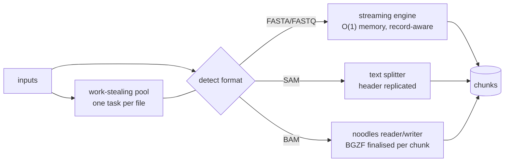

```
   ___ _
  / __\ | ___  __ ___   _____ _ __
 / /  | |/ _ \/ _` \ \ / / _ \ '__|
/ /___| |  __/ (_| |\ V /  __/ |
\____/|_|\___|\__,_| \_/ \___|_|
```

# Cleaver ✂️

[](https://www.rust-lang.org)
[](#-build)
[](#-correctness)
[-success.svg)](#-design)
[](#-formats)
[](#-license)
[](#-parallelism-in-node--cross-node)

**A streaming, record-aware toolkit for the everyday sequence and alignment
formats.** Cleaver splits FASTA, FASTQ, SAM, and BAM into chunks **without ever
cutting a record in half**; converts between SAM and BAM (with **mapped/unmapped**
partitioning) and FASTQ→FASTA; reports **genome/assembly statistics** (N50/L50/N90,
lengths, GC%); **counts reads per feature** from one or more BAM/SAM files against
a GTF/GFF annotation (**featureCounts/htseq-style**); and fans work out
one-file-per-task — on a work-stealing pool in-node, or across a whole cluster via
the vendored **HydraMPP** engine. The sequence path streams at constant memory;
the alignment path uses [`noodles`](https://github.com/zaeleus/noodles), the
pure-Rust htslib equivalent.

---

## 📦 Formats

| Family | Extensions | Split unit | Engine |
|---|---|---|---|
| FASTA | `.fasta .fa .fna .ffn .faa .frn .mpfa .fas` | size (`--chunk-size`) | streaming, byte-level |
| FASTQ | `.fastq .fq` | size (`--chunk-size`, 4-line aware) | streaming, byte-level |
| SAM | `.sam` | records (`--records`) | text, header replicated |
| BAM | `.bam` | records (`--records`) | `noodles` (BGZF) |

`.gz` inputs are decompressed transparently. Format is auto-detected from the
extension, falling back to a content sniff. Chunks keep the input's extension
(`genome.fna` → `genome.00000.fna`); SAM/BAM chunks are written as `.sam`/`.bam`.

---

## 📥 Install

> **`cargo build` does *not* put `cleaver` on your `PATH`.** It writes the binary
> to `target/release/cleaver`; typing bare `cleaver` then gives
> `cleaver: command not found`. Pick one of these:

```bash
# A) one-shot installer: builds release + puts `cleaver` on your PATH (recommended)
./install.sh                  # default backend; ./install.sh hydra  or  hydra,gpu
#   DEST=/usr/local/bin ./install.sh   to choose the install dir

# B) cargo install
cargo install --path cleaver-cli            # -> ~/.cargo/bin/cleaver
export PATH="$HOME/.cargo/bin:$PATH"        # if not already; add to ~/.bashrc / ~/.zshrc

# C) or build and run by full path
cargo build --release
./target/release/cleaver doctor

# then confirm the install is healthy:
cleaver doctor
cleaver --version      # also -v
```

Add `--features hydra` (cluster backend) and/or `--features gpu` (CUDA stats
kernel) to either `cargo install` or `cargo build`.

## 🩺 Self-test (`cleaver doctor`)

`cleaver doctor` verifies the install end-to-end — it writes tiny inputs to a
temp dir and exercises the real engine (FASTA split + lossless reassembly,
FASTQ→FASTA, SAM↔BAM round-trip, mapped/unmapped partition, base-composition
stats, format detection, GPU detection, and — with `--features hydra` — a live
local HydraMPP task), printing a pass/fail line per check and exiting non-zero on
any failure:

```text
$ cleaver doctor
  [ ok ] fasta split            3 chunks, byte-identical reassembly
  [ ok ] sam -> bam -> sam      3 records preserved each way (noodles/BGZF)
  [ ok ] mapped/unmapped split  2 mapped + 1 unmapped, routed by 0x4 flag
  [ ok ] hydra engine           local runtime ran 5 tasks correctly
  ...
  9/9 checks passed.  cleaver is healthy. ✓
```

## 🚀 Usage

```bash
# split — auto-detects format per file; runs files in parallel (-t, 0 = all cores)
cleaver split reads.fastq genome.fna aln.bam -o out/ -c 256M -r 1000000

# every FASTA variant, every FASTQ; gzip transparent
cleaver split contigs.ffn proteins.faa reads.fq.gz -o out/ -c 100M

# convert — direction inferred from extensions
cleaver convert aln.sam aln.bam            # SAM -> BAM (BGZF)
cleaver convert aln.bam aln.sam            # BAM -> SAM
cleaver convert reads.fastq reads.fasta    # FASTQ -> FASTA (drops quality)

# convert with mapped/unmapped selection (alignment inputs)
cleaver convert aln.sam aln.bam --mapped-only      # keep only mapped reads
cleaver convert aln.sam aln.bam --unmapped-only    # keep only unmapped reads
cleaver convert aln.sam aln.bam --partition        # -> aln.mapped.bam + aln.unmapped.bam

# stats — genome/assembly statistics: N50/L50/N90, lengths, GC% (GPU base-comp if built --features gpu)
cleaver stats genome.fna contigs.ffn reads.fq

# count — featureCounts/htseq-style reads-per-feature from BAM/SAM vs a GTF/GFF
cleaver count sampleA.bam sampleB.bam sampleC.bam -a genes.gtf -o counts.tsv
#   -> counts.tsv (gene x sample matrix) + counts.tsv.summary (assignment categories)

# environment / accelerators / backend
cleaver info

# health check (verify the install and every code path)
cleaver doctor

# version
cleaver --version          # or -v
```

### Scaling across a cluster (HydraMPP)

Built `--features hydra`, the same subcommands fan tasks across a
[HydraMPP](https://github.com/raw-lab/HydraMPP) cluster — the engine is vendored
in-tree (`vendor/hydra-mpp-core`), no external dependency:

```bash
cargo build --release --features hydra

# head node (workers connect in); then split/stats fan out across the cluster
cleaver split *.fna -o out/ --head
# each worker joins the head:
cleaver split --client 10.0.0.1
# simulate GPU scheduling on a CPU-only box (devices get pinned per task):
cleaver stats *.fna --sim-gpus 4
```

Splitting bounds map to each family's natural unit: **sequence** files by size
(`-c/--chunk-size`, e.g. `1G`, `256M`, `50Mi`), **alignment** files by record
count (`-r/--records`). Every SAM/BAM chunk carries the full header (and, for
BAM, a finalised BGZF EOF block), so each chunk is an independently valid file.

---

## 📖 CLI reference

`-h` shows help for any command (every command prints the banner); `-v` /
`--version` prints the version. Built `--features hydra`, the cluster flags
`--head`, `--client <ADDR>`, `--cpus <N>`, `--sim-gpus <N>`, `--port <PORT>` are
available globally.

### `cleaver split <INPUTS>…`
Record-aware chunking, one task per file.

| Flag | Default | Meaning |
|---|---|---|
| `-o, --outdir <DIR>` | *required* | Output dir; chunks named `<stem>.NNNNN.<ext>`. |
| `-c, --chunk-size <SIZE>` | `1G` | Max chunk size for FASTA/FASTQ (`1G`, `256M`, `50Mi`, …). |
| `-r, --records <N>` | `1000000` | Records per chunk for SAM/BAM. |
| `-t, --threads <N>` | `0` | In-node worker threads (0 = all cores). |
| `--format <fasta\|fastq\|sam\|bam>` | auto | Force a format. |

### `cleaver convert <INPUT> <OUTPUT>`
SAM↔BAM (BGZF) and FASTQ→FASTA; the target is taken from `<OUTPUT>`'s extension.

| Flag | Meaning |
|---|---|
| `--partition` | Alignment: write `<out>.mapped.<ext>` + `<out>.unmapped.<ext>`. |
| `--mapped-only` | Keep mapped records only. |
| `--unmapped-only` | Keep unmapped records only. |

### `cleaver stats <INPUTS>…`
Genome/assembly statistics for FASTA/FASTQ (rejects SAM/BAM). Per file and a
`TOTAL`: sequence count, total bp, min/max/mean/median length, **N50 / L50 /
N90**, GC%, and the compute device. Base composition runs on the GPU with
`--features gpu`; the length/N50 pass is CPU. The N/L assembly metrics are
computed by the vendored [`rustyomestats`](https://github.com/raw-lab/rustyomestats)
crate (`stats::compute_nl`); it is vendored in-tree at `vendor/rustyomestats` and
built dependency-free (its heavier `full` feature — bio/polars/plotters and the
CLI — is not enabled, so cleaver still compiles on rustc 1.75).

| Flag | Default | Meaning |
|---|---|---|
| `-t, --threads <N>` | `0` | In-node worker threads (0 = all cores). |
| `--format <…>` | auto | Force a format. |

### `cleaver count <INPUTS>… -a <GTF/GFF> -o <MATRIX>`
featureCounts/htseq-style reads-per-feature from **one or more** BAM/SAM files
against a GTF/GFF annotation. Flag names mirror featureCounts.

| Flag | Default | Meaning |
|---|---|---|
| `-a, --annotation <FILE>` | *required* | GTF or GFF3 annotation. |
| `-o, --output <FILE>` | *required* | Count matrix (TSV); `<output>.summary` written alongside. |
| `-t, --feature-type <TYPE>` | `exon` | Column-3 feature type to count. |
| `-g, --group-by <ATTR>` | `gene_id` | Attribute grouping features into meta-features. |
| `-s, --stranded <0\|1\|2>` | `0` | 0 unstranded · 1 stranded · 2 reverse-stranded. |
| `-Q, --min-mapq <N>` | `0` | Drop alignments below this MAPQ. |
| `-M, --count-multimappers` | off | Count `NH>1` reads (else discarded). |
| `-O, --allow-multi-overlap` | off | Count reads hitting several meta-features for all of them. |
| `--mode <union\|strict\|nonempty>` | `union` | htseq overlap resolution. |
| `-T, --threads <N>` | `0` | In-node worker threads, one file per task (0 = all cores). |

**Outputs.** `<output>` is a meta-feature × sample matrix — a `gene_id` column
then one column per input file (named by basename). `<output>.summary` is the
featureCounts category table (`Assigned`, `Unassigned_NoFeatures`,
`Unassigned_Ambiguity`, `Unassigned_MultiMapping`, `Unassigned_MappingQuality`,
`Unassigned_Unmapped`) per file. A per-file assignment recap prints to stdout.

```bash
# exons by gene across three BAMs, unstranded, drop MAPQ < 10
cleaver count A.bam B.bam C.bam -a genes.gtf -o counts.tsv -Q 10

# reverse-stranded library; count CDS grouped by gene; strict overlaps
cleaver count *.bam -a anno.gff3 -o cds.tsv -s 2 -t CDS --mode strict
```

**Counting model.** Each primary, mapped alignment passing the MAPQ/multimapper
filters is reduced to its reference blocks (CIGAR `M/=/X/D` extend a block, `N`
splits at introns) and tested against the index. Exactly one meta-feature →
*assigned*; none → *no-feature*; more than one → *ambiguous* (unless `-O`).
`--mode union` (default, == featureCounts' any-overlap) counts any feature
touching the read; `strict` requires every base of the read to be covered;
`nonempty` is strict over only the covered bases. The N/L and overlap algorithms
follow the standard featureCounts/htseq definitions.

**Caveats.** Reads are counted individually (single-end semantics); paired ends
are counted per mate, not per fragment. The annotation is parsed once per input
file; under `--features hydra` it must be readable on each worker node.

### `cleaver version` · `cleaver doctor` · `cleaver info`
`version` prints the banner, version, backend, and GPU-kernel status. `doctor`
runs the built-in self-test (splitting, conversion, partition, base composition,
genome N50, counting, format/GPU detection, and a live HydraMPP task when built
`--features hydra`). `info` lists version, cores, backend, GPUs, and the
supported formats/commands.

---

## 🧩 How it works



* **Sequence formats** stream one line at a time through 1 MiB buffers, tracking
  bytes in memory (no `fstat` per boundary). A new chunk starts at the next
  record boundary once the current chunk passes the target size, so chunks
  overshoot by at most one record and are never cut mid-record.
* **SAM** is split as text: the leading `@` header block is replicated at the
  top of every chunk.
* **BAM** is split through `noodles`: header written per chunk, records copied,
  and `finish()` called per chunk to emit the BGZF EOF block (a missing EOF is
  the classic way to produce a truncated, unreadable BAM — Cleaver does not).

---

## ⚡ Parallelism (in-node + cross-node)

Work is **one task per file**. The default build runs tasks on a work-stealing
pool ([`rayon`](https://github.com/rayon-rs/rayon)); `-t 0` uses all logical
cores. Built `--features hydra`, the *same* task functions run on a **HydraMPP**
cluster instead — multi-core on one box, or across nodes, with no other code
change. The `cleaver-core` engine runs unchanged on whichever worker receives a
file.

HydraMPP is **vendored in-tree** (`vendor/hydra-mpp-core`, a workspace member),
so there is no external dependency to fetch. Because a scheduler cannot ship a
closure to a remote process, each unit of work is a *named* function over
`serde`-serializable jobs (`cleaver-cli/src/jobs.rs`), registered with HydraMPP
and dispatched with `--head` / `--client ADDR`; the request is clamped to each
node's advertised resources so it schedules rather than fails fast.

> HydraMPP keeps `panic = "unwind"` so one panicking task can't abort a worker;
> Cleaver's release profile matches. The default (rayon) backend remains fully
> tested in-sandbox; the HydraMPP backend is exercised here in local mode.

## 🖥️ GPUs

Splitting and conversion are I/O-bound, so they have **no GPU kernel**. Base
composition / GC (`stats`), by contrast, is a reduction over millions of bytes —
genuinely data-parallel — so it has a real GPU path:

* **Scheduling.** Under HydraMPP, `stats` reserves a GPU per task; the scheduler
  **pins** a concrete device id (race-free, via `current_gpus()`), shown in the
  `device` column. `--sim-gpus N` exercises this on CPU-only hardware (you'll see
  `cpu(gpu:0)` — device pinned, kernel run on CPU).
* **Kernel.** Built `--features gpu`, a [`cudarc`](https://github.com/coreylowman/cudarc)
  kernel streams sequence bytes to the device in 64 MiB batches and builds a
  256-bin byte histogram with one `atomicAdd` per base, then folds the bins into
  A/C/G/T/N/other — *identical arithmetic* to the CPU reference, so results match
  bit-for-bit. `cudarc` needs the CUDA toolkit and rustc ≥ 1.85 at build time, so
  it is **off by default** and built on GPU hosts; the CPU path is what the test
  suite exercises, and `stats` falls back to it automatically when no device is
  present.

`cleaver info` reports the active scaling backend, whether the GPU kernel was
compiled in, and any NVIDIA GPUs detected via `nvidia-smi` (no build dependency).

---

## 🏁 Benchmarks

Measured in-sandbox (single core, rustc 1.75, warm cache, best of 3). No numbers
are fabricated; field tools that are not pure-Rust or not reachable here
(`seqkit`, `samtools`) are named but not benchmarked.

**FASTA split** — 180 MB / 35,839 records, `>`-delimited, 32 MB chunks:

| tool | best (s) | peak RSS | record-safe? |
|---|---:|---:|:--:|
| **cleaver** (streaming) | **0.17** | **7 MB** | ✅ 0/6 broken |
| naive Rust (in-memory) | 0.22 | 206 MB | ✅ |
| python original | 0.49 | 13 MB | ✅ |
| GNU `split -b` | 0.06 | 1.8 MB | ❌ 5/6 mid-record |

vs a naive in-memory Rust splitter (same compiler): comparable-to-faster wall
time and **~30× less memory** — the naive RSS scales with file size, Cleaver's is
flat. vs Python: ~3× faster. `split` is faster only because it skips boundary
logic and corrupts 5 of 6 records.

**Alignment** — 300,000 records (47 MB SAM ↔ 9.7 MB BAM), single core:

| operation | time (s) | peak RSS | throughput |
|---|---:|---:|---|
| SAM → BAM convert | 1.38 | 4.4 MB | ~217k rec/s |
| BAM → SAM convert | 0.34 | 3.3 MB | ~880k rec/s |
| BAM split (`-r 50000`) | 1.46 | 3.7 MB | 6 chunks, lossless |
| SAM split (`-r 50000`) | 0.05 | 4.1 MB | 6 chunks, lossless |

Memory stays flat (3–4 MB) regardless of file size on the alignment path too.

**Stats (base composition / GC)** — CPU path, 172 MB FASTA / 175.6 M bases,
single core: **1.52 s at 4.6 MB RSS** (~115 M bases/s), memory flat. The GPU
kernel (`--features gpu`) targets this same reduction on CUDA hardware.

---

## 🔧 Build

```bash
# rustc 1.75+ (no rustup needed)
cargo build --release            # -> target/release/cleaver  (rayon backend)
cargo build --release --features hydra   # + HydraMPP cluster backend
cargo build --release --features gpu     # + CUDA stats kernel (needs CUDA toolkit, rustc 1.85+)
cargo test --workspace           # 15 unit + doctests, all passing
```

MSRV is held at **1.75** by pinning `noodles-sam=0.52`, `noodles-bam=0.55`,
`noodles-bgzf=0.26`, `indexmap=2.2.6`, `rayon=1.10`, `rayon-core=1.12.1`. A fully
static binary builds with the `x86_64-unknown-linux-musl` target.

### ✅ Correctness

`#![forbid(unsafe_code)]` on the core crate (the CLI's GPU launch is the only
`unsafe`, behind `--features gpu`). Tests cover FASTA/FASTQ losslessness and
boundary behaviour, SAM header replication, SAM↔BAM round-trips, BAM-chunk
validity, FASTQ→FASTA, mapped/unmapped filtering and partitioning, base
composition / GC, **genome stats (N50/L50/N90, lengths, median)**, GTF/GFF
parsing, CIGAR intron-splitting, and **count assignment** (unique / ambiguous /
no-feature, strandedness, multimapper and MAPQ filters, and the union / strict /
nonempty overlap modes). End-to-end (verified here): all FASTA variants, FASTQ,
gzip, and multi-file parallel split reassemble byte-identical; `--partition`
routes every record by its `0x4` flag (6 mapped + 4 unmapped, lossless); `stats`
emits the genome table across files; and `count` produces an identical
gene × sample matrix and `.summary` whether run on the in-node pool or across the
HydraMPP backend with devices pinned per task.

---

## 📚 Citation

```bibtex
@software{white_cleaver_2025,
  author  = {White III, Richard Allen},
  title   = {Cleaver: a streaming, record-aware splitter and converter for
             FASTA/FASTQ/SAM/BAM},
  year    = {2025},
  note    = {Pure-Rust; noodles for SAM/BAM; rayon in-node, HydraMPP cross-node},
  license = {CC-BY-NC-4.0}
}
```

## 📄 License

Creative Commons Attribution-NonCommercial 4.0 International (**CC-BY-NC-4.0**).
Free for academic and non-commercial use; contact the author for commercial use.
